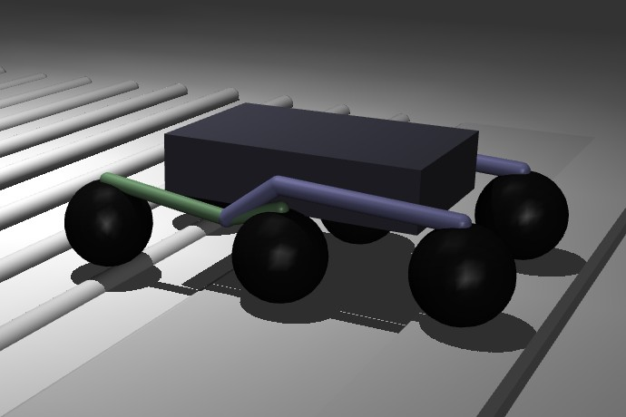

# Rocker-Bogie Rover Simulation in MuJoCo

<p align="center">
  
</p>

Симуляция движения 6-колёсного ровера с пассивной подвеской Rocker-Bogie в физическом движке MuJoCo. Проект реализует два подхода управления и сравнивает их эффективность.

## 📋 Постановка задачи

**Объект:** 6-колёсный робот с пассивной подвеской Rocker-Bogie

**Проблема:** при движении по пересечённой местности на высокой скорости возникают ударные нагрузки, создающие риск для электроники и полезной нагрузки

**Цель:** найти закон скорости \( v(s) \), минимизирующий **время прохождения трассы** при жёстком ограничении
\[
\max|z''(t)| \leq 15 \frac{\text{м}}{\text{с}^2} \quad (\approx 1,5g)
\]

## 🎯 Цель и задачи

### Цель проекта
Смоделировать движение марсохода в физическом движке MuJoCo и сравнить два подхода управления:
- **Постоянный момент** на колёсах (без обратной связи)
- **Адаптивная скорость** (PID-регулятор с коррекцией по вертикальному ускорению)

### Задачи
- Запуск симуляции на сцене с препятствиями (ступеньки + синусоиды)
- Реализация двух стратегий управления
- Сбор метрик движения (скорость, ускорение, время прохождения)
- Визуализация результатов (графики)
- Сравнительный анализ эффективности подходов

## 📁 Структура проекта
Rocker-Bogie_Project/
├── src/
│ ├── main.py # Главная точка входа (CLI)
│ ├── sim/
│ │ └── sim_runner.py # Общий цикл симуляции
│ ├── control/
│ │ ├── pid_controller.py # PID-регулятор
│ │ ├── constant_torque.py # Постоянный момент на колёсах
│ │ ├── adaptive_speed.py # Адаптивная скорость
│ │ └── acceleration_filter.py # Медианная фильтрация ускорения
│ └── assets/
│ ├── scene_stairs_logs_modified.xml # Сцена с препятствиями
│ └── rover_one_side_2d.xml # Модель ровера
├── pic/ # Скриншоты и диаграммы
├── .gitignore # Исключаемые файлы
├── README.md # Описание проекта
└── requirements.txt # Python-зависимости

### Назначение модулей

| Файл | Назначение |
|------|------------|
| `main.py` | Обработка аргументов командной строки, запуск симуляции |
| `sim_runner.py` | Цикл симуляции MuJoCo, сбор данных, логирование |
| `pid_controller.py` | Класс PID-регулятора с антивиндапом |
| `constant_torque.py` | Контроллер с постоянным моментом (без обратной связи) |
| `adaptive_speed.py` | Адаптивный контроллер с коррекцией по ускорению |
| `acceleration_filter.py` | Медианная фильтрация вертикального ускорения |

## 🚀 Установка и запуск

### Требования
- Python 3.8 или выше
- MuJoCo 3.0+
- pip (менеджер пакетов)

### Установка зависимостей

```bash
pip install -r requirements.txt
```
### Запуск
Режим с постоянным моментом (по умолчанию)
```bash
python src/main.py
```
Режим с адаптивной скоростью
```bash
python src/main.py --mode adaptive
```
С выбором момента и сцены
```bash
python src/main.py --mode constant --torque 0.15 --scene src/assets/scene_stairs_logs_modified.xml
```

## 📊 Результаты и выводы

### Сравнительный анализ режимов управления

| Показатель | Постоянный момент | Адаптивная скорость | Результат |
|------------|-------------------|---------------------|-----------|
| Время прохождения (с) | 15.81 | 12.81 | Адаптивная скорость на **19%** быстрее |
| Средняя скорость (м/с) | 1.094 | 1.630 | Адаптивная скорость на **49%** выше |
| Макс. скорость (м/с) | 1.516 | 2.527 | Адаптивная скорость на **67%** выше |
| Макс. вертикальное ускорение (м/с²) | 13 | 13.3 | Постоянный момент на **1.7%** меньше |

### Ключевые выводы

1. **Адаптивная скорость** значительно быстрее (на 19%) проходит трассу за счёт динамической подстройки скорости
2. При этом **пиковые ускорения** остаются на сопоставимом уровне (13.0 vs 13.3 м/с²)
3. Адаптивный режим обеспечивает более высокую **среднюю скорость** (на 49% выше)
4. Ограничение \( \max|z''(t)| \leq 15 \, \text{м/с}^2 \) **соблюдается** в обоих режимах

### Заключение

Адаптивное управление скоростью позволяет **существенно сократить время прохождения** трассы без превышения допустимых ударных нагрузок. Рекомендуется для применения в реальных условиях движения по пересечённой местности.

Тихонов В.С.; Фомин В.М.
